## Ligand Library Design

**Background:** ML algorithms are capable of searching extensive chemical spaces
for the best starting points for a drug development program. This leaves us with the question of
how do we design and construct the virtual library which will be searched during this process.

**Goal:** Construct a library of 10,000 distinct compounds, which are all synthesizable. The library
should be optimized for chemical diversity, to span as much of the chemical space as possible.

This problem target the main apex pain point hindering chemical modeling today. Given the rise of the genomic and protenoimics have discovered therapeutic targets with no small molecule modulators. The demand asks for more increased virtual high throughput screening but with a lack of adequate screening libraries. 

Questions arise:
    - How do we construct these chemical libraries?
    
    - How do we construct these chemical libraries expanding the most chemical diversity possible?
    
    - How do we construct chemical libraries exploring as many combinations of representation of data as possible? 
    
    - Added on to this what style of chemical libaries are we constructing? (Natural/Non-Natural Amino Acids versus small molecule inhibitors) 
    
    - How do we create these chemical libraries so it adheres to easy synthesis or, to make the chemists happy, can be constructed through click chemistry methods.
    
    - How do construct datasets that are not in violation with existing patents for pharma companies today? 

#### Ligand Selection

For this study I am using the MolPort catalog as my dataset. Molport is a free open source database housing ~4.2mil+ compounds used as building blocks. Molport's database is diverse enough in terms of Chemical Space where we can explore freely. 

There's a couple of things we need to consider for choosing our data set and I've gone for the Principal Moments of Inertia approach. 

What this really entails that a molecule would fit into one of three different shapes or be more geared towards one direction (rod, sphere, or disc).

    - Rod: Means the molecule is more elongated like a peptide backbone chain
    - Sphere: Means the molecule is more 3D for example bridged conformations.
    - Disc: Means the molecule is more 2D but round. For example benzene rings are disc-like but with the sp2 carbons they remain flat.
    
For a first pass implementation of the docking to a protein of unknown character we can extrapolate the information based on what type of shape the protein responds to. 

The graph would be a depiction like this with example molecules listed below:

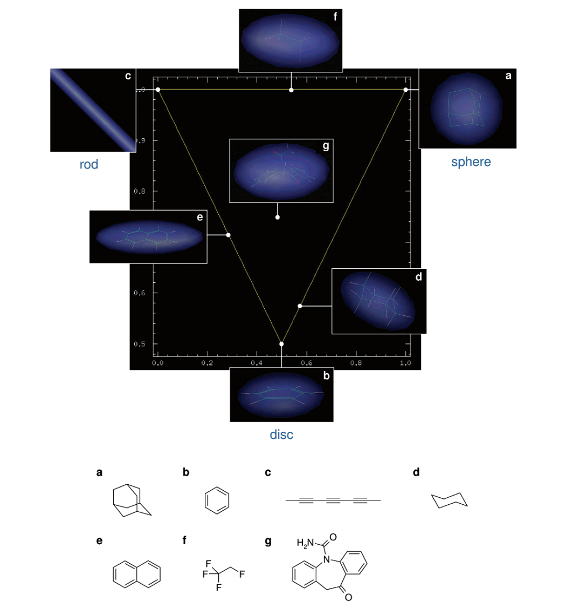

So what would our dataset of molecules look like:

Here is an example of what is being used in the experiment:

And maybe more within the imgs folder. 

So if we choose roughly ~100 molecules that's not too many to get an accurate analysis, how do we enumerate this dataset. Hint: Read to the next section....

#### Enumeration

How are we going to Enumerate these molecules, well the idea stems from Eugene A. Markush who invented the representation of a foundation molcule with selective R Groups. These R groups could range from anything and used to gain complete statistical 2D rendering of molecules that are synthesizable.  

Here is an example of a Markush Structure:

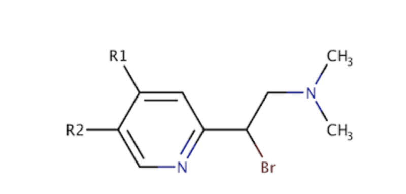

We can actually use markush structures to expand the 2D set the only conflicting ideaology is that we might run into some legal issues when extrapolating data. 

What's the algorithm for doing such things? Well thankfully someone already has actually tackled that for us. Free-Wilson implement a SAR analysis for markush structures that help us in computationally designing an experiment. 

I've included the python implementation of the Free-Wilson Library below (with some modifications) to help us generate the structure.

Here is an example of enumeration:

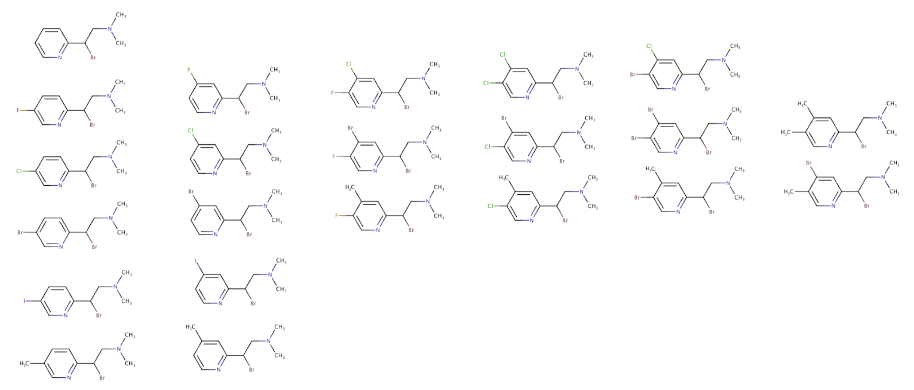

So we can combine the R groups with our scaffold molecule and we have automatically 22 molecules with different combinations! 

What if we enumerated our dataset of 100 molecules times the 22 modifications to the R Groups, based on what we can remove and then implement. The results can be exponential. If you head into the free wilson implementation and preparation of the molcules we can run through just that. 

#### Enumeration

Since we are implementing for a machine learning algorithm we need to verify that we are augmenting the data. What do I really mean by that?

Well machine learning algorithms need all representations of the data to make a reasonable conclusion.

For example take this cat photo:

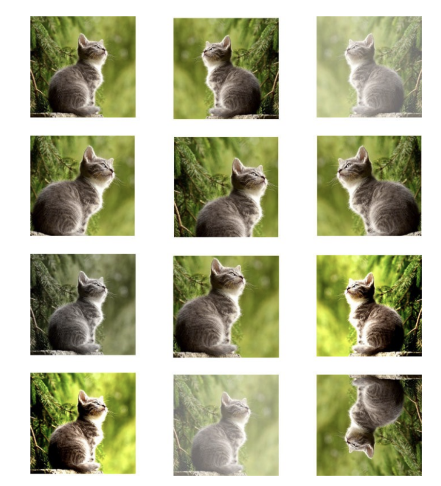

Here we have representation of a cat in all different forms, the algorithm will have to learn that all of these images are still a cat at it's core. 

This is the same case as SMILES for feeding into data sets. We need to actually have multiple representation of SMILES.

Conveniently, there is a script inside labeled as enumerate_smiles.py that does exactly that! 

With one molecule we can average generated ~75 smiles variations depedent on size of the molecule. 

So with our molecule set I enumerated all smiles and what do you know we have roughly 5000+ different smiles representation of molecules with combinations of R group.

Our molecular weight distribution looks a little like this:

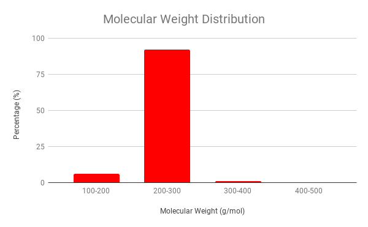

Our LogP Graph:

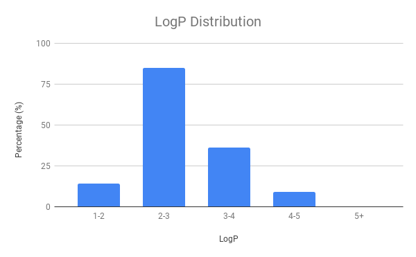

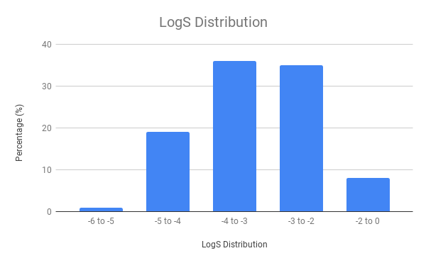

The experiment will head into workflow like so:

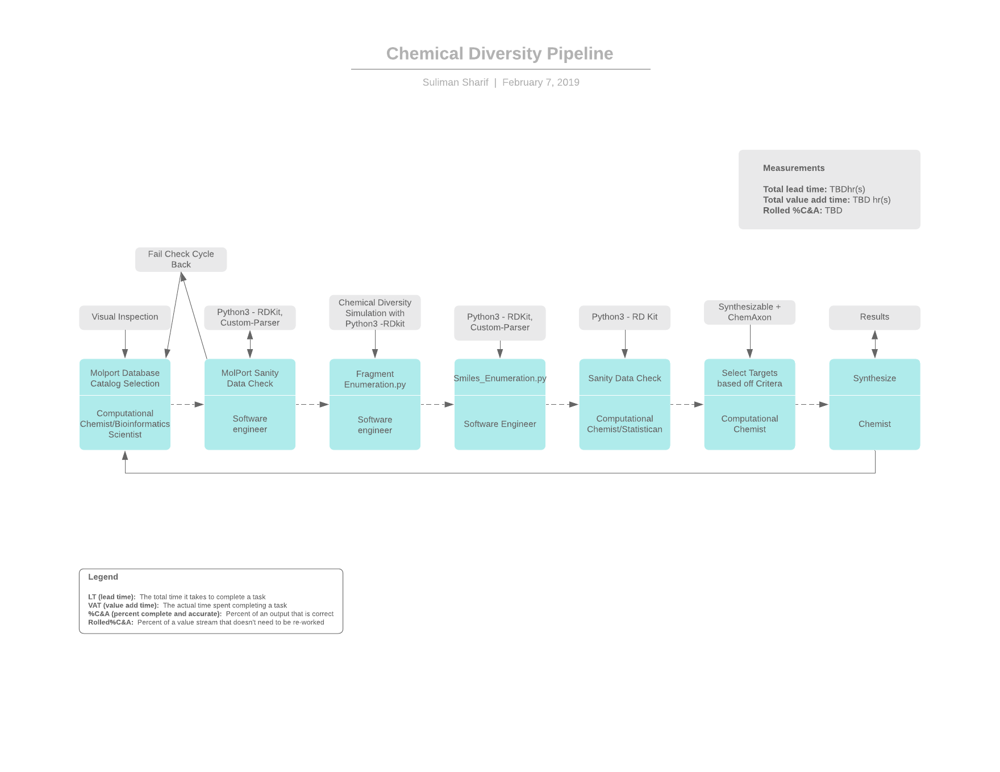

Next Steps

- Dynamic Creation of fragmentation with set amount of R Groups with the experimentation script.
- Eliminate the duplicates in SMILES and 2D representations. 

Idea behind it:

Take the Core:

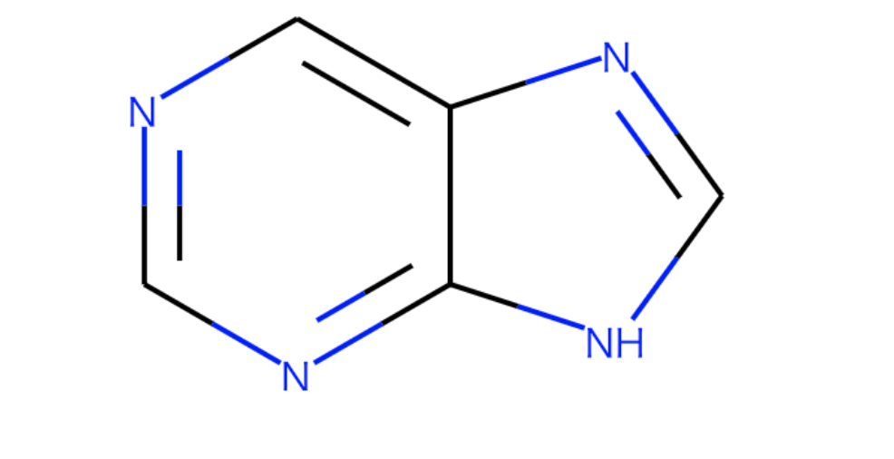

Fragmentation

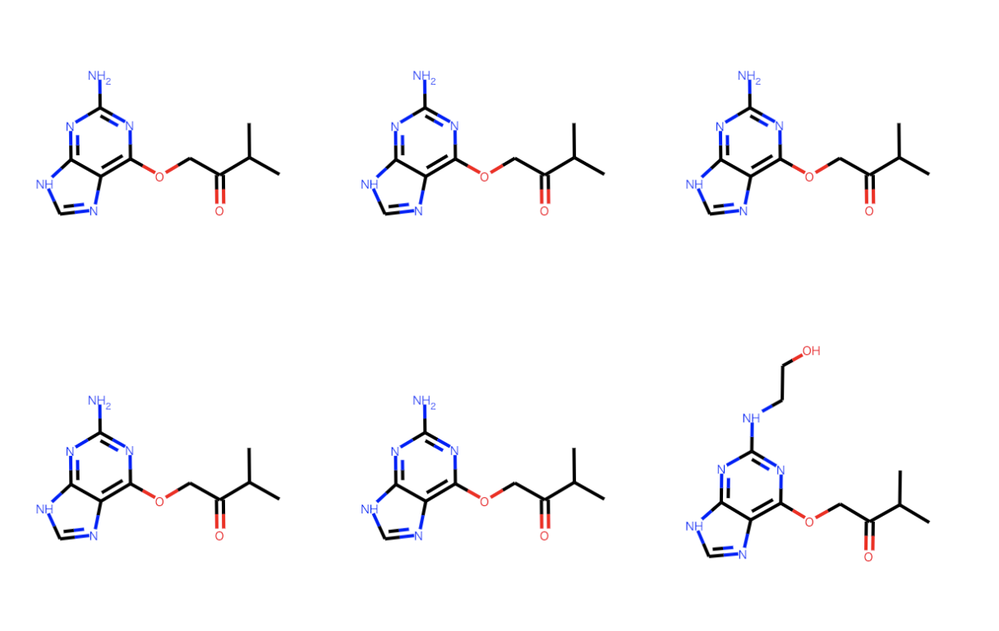

- RetroPath 2.0

So you are think of reactions and how that is actually synthesizable. Well we are going to implement the great library of RetroPath2.0....more on that later as it is being developed. 

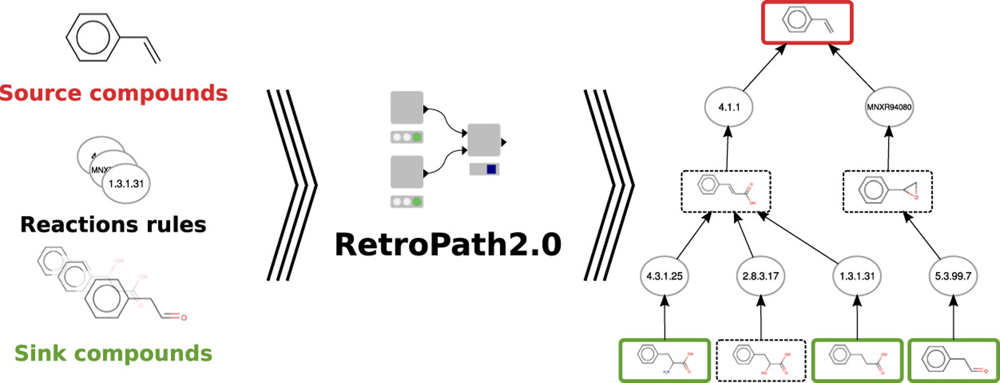

Awaiting ChemAxon Response:

- Automatic Markush Construction

- Patent Search

Acknoledgements:

