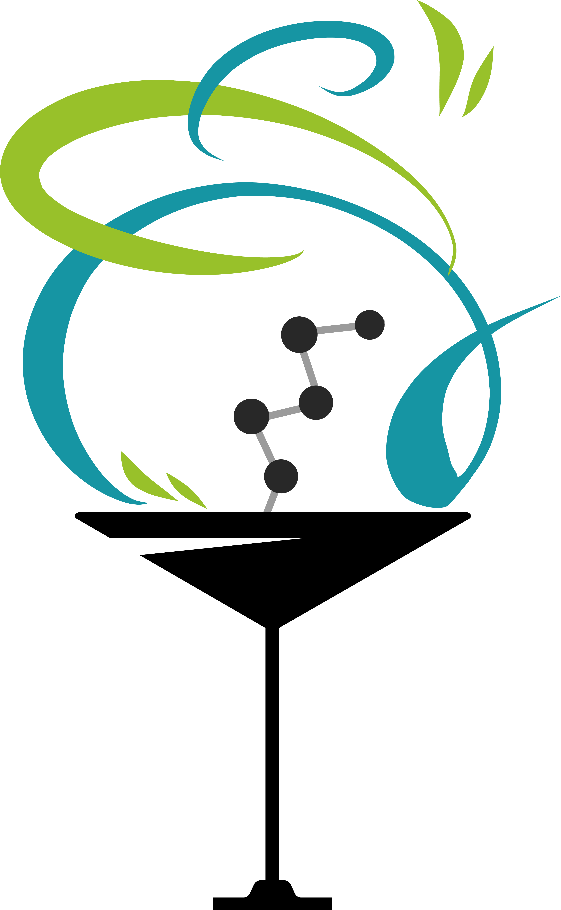

Cocktail Shaker: Drug Expansion and Enumeration!
================================================

[](https://travis-ci.org/Sulstice/Cocktail-Shaker)
[](https://github.com/Sulstice/Cocktail-Shaker/blob/master/LICENSE)
[](https://coveralls.io/github/Sulstice/Cocktail-Shaker?branch=master)

[](https://gitter.im/Cocktail-Shaker/community?utm_source=badge&utm_medium=badge&utm_campaign=pr-badge&utm_content=badge)
[](https://zenodo.org/badge/latestdoi/170644606)
[](https://cocktail-shaker.readthedocs.io/en/latest/?badge=latest)

<p align="center">
  
</p>

cocktail-shaker is a **high-performance drug enumeration and expansion
library**. cocktail-shaker leverages the computational power of
**RDKit** to create and enumerate large volumes of drug compounds. 
-File parsing of TXT, SDF, and Chemical SMILES.
- File writing in a variety of formats some of which include: cif, sdf, pdb, mol, mol2, and more.
- Ability to recognize and expand libraries of compounds some of which include: halogens, acyl halides, aldehydes. 
- Ability to enumerate in 1D and 2D structures and produce those compounds.

Announcements
=============

-   **Release!** Version 1.0.0-beta, August 26, 2019
-   **RDkit UGM 2019**: talk at September 25th at the University of
    Hamburg, Germany.

Using Cocktail Shaker
=====================

cocktail-shaker is a young library under heavy development at this time.
It targets two categories of users:

1.  **Users familiar with RDKit**, or those willing to learn RDKit, who want to
    create fast sets of data for high throughput screening or machine
    learning.
2.  **Open-Science Scientists without any knowledge of RDKit** who are
    seeking a a high-level wrapper to create chemical files for their
    software.

If you're in the first category, then you can already start using RDKit.
cocktail-shaker offers a Pythonic, easy-to-use library and you can start
channeling molecules in the expansion library. Instead of validating the
sanity of the data, cocktail-shaker takes care of that for you. With
each molecule being generated it will head into a 1D and/or 2D
validation check (3D not supported yet).

If you're in the second category, we're starting to build experimental
high-level python code to take care a lot of the underpinnings of RDKit.

Installation 
==================

cocktail-shaker runs on Python 3.3+ and depends on RDKit version (make sure you have this installed!).

To install RDKit, set up an environment through this:

``` $ conda install -q -c rdkit rdkit ```

cocktail-shaker can be installed either via \`pip\`:

`` ` pip install cocktail-shaker``\`

or within the [Anaconda](https://www.anaconda.com/download/) Python
distribution. Anaconda provides a convenient package management system.
Installing VisPy can then easily be achieved by adding conda-forge to
the channels with:

`` ` conda config --add channels conda-forge ``\`

Once the conda-forge channel has been enabled, cocktail-shaker can be installed
with:

`` ` conda install ``\`

Development Installation
========================

As cocktail-shaker is under heavy development at this time, we highly
recommend developers to use the development version on Github (master
branch). You need to clone the repository and install cocktail-shaker with

`python setup.py install`.

As a one-liner, assuming git is installed:

    git clone https://github.com/Sulstice/Cocktail-Shaker.git

This will automatically install the latest version of cocktail-shaker.

Structure of cocktail-shaker
============================

Currently, the main subpackages are:

-   **cocktail_shaker**: Contains a lot of the high level functionality; request
    handling, file parsing/writing, enumeration, and expansion.
-   **docs**: An access point for the readthedocs implementation.
-   **datasources**: This is where the system stores its data on
    predfined functional groups and/or shapes (coming soon).
-   **tests**: Tests that are for the file handling, requests, and
    testing molecule pattern recognition.

The API of all public interfaces are subject to change in the future,
although **datasources** are *relatively* stable at this point.

Genesis
=======

cocktail-shaker began when one developer/scientist wanted an open source
drug library.

- Lead Developer [Suliman sharif](http://sulstice.github.io/)
- Artwork [Elena Chow](http://www.chowelena.com/)
- Technical Documentation [Rose Gierth](https://www.linkedin.com/in/rose-gierth-69a4a083/)
- QA Tester [Marvin Corro](https://www.linkedin.com/in/marvincorro/)

Now cocktail-shaker looks to build on the expertise of these
developers/scientists and the broader open-science community to build an
effective drug library.

* * * * *

External links
==============

-   [Documentation](http://cocktail-shaker.readthedocs.org)

